```python
import pandas as pd
import numpy as np
import matplotlib.pyplot as plt
from scipy.stats import linregress
from scipy.stats import sem
import scipy.stats as stats
```


```python
clinicaldata = "raw_data/clinicaltrial_data.csv"
mousedata = "raw_data/mouse_drug_data.csv"
```


```python
clinicaldata_pd= pd.read_csv(clinicaldata)
mousedata_pd= pd.read_csv(mousedata)
clinicaldata_pd.head()
```


<div>
<style>
    .dataframe thead tr:only-child th {
        text-align: right;
    }

    .dataframe thead th {
        text-align: left;
    }

    .dataframe tbody tr th {
        vertical-align: top;
    }
</style>
<table border="1" class="dataframe">
  <thead>
    <tr style="text-align: right;">
      <th></th>
      <th>Mouse ID</th>
      <th>Timepoint</th>
      <th>Tumor Volume (mm3)</th>
      <th>Metastatic Sites</th>
    </tr>
  </thead>
  <tbody>
    <tr>
      <th>0</th>
      <td>b128</td>
      <td>0</td>
      <td>45.0</td>
      <td>0</td>
    </tr>
    <tr>
      <th>1</th>
      <td>f932</td>
      <td>0</td>
      <td>45.0</td>
      <td>0</td>
    </tr>
    <tr>
      <th>2</th>
      <td>g107</td>
      <td>0</td>
      <td>45.0</td>
      <td>0</td>
    </tr>
    <tr>
      <th>3</th>
      <td>a457</td>
      <td>0</td>
      <td>45.0</td>
      <td>0</td>
    </tr>
    <tr>
      <th>4</th>
      <td>c819</td>
      <td>0</td>
      <td>45.0</td>
      <td>0</td>
    </tr>
  </tbody>
</table>
</div>


```python
merge_table = pd.merge(mousedata_pd, clinicaldata_pd, on="Mouse ID", how="outer")
merge_table = merge_table.dropna(axis = 1,how="any")
```


```python
table1 = pd.pivot_table(merge_table,values = "Tumor Volume (mm3)",index = ["Timepoint"],columns = ["Drug"],aggfunc=np.mean)
table1sem = pd.pivot_table(merge_table,values = "Tumor Volume (mm3)",index = ["Timepoint"],columns = ["Drug"],aggfunc=stats.sem)
table1
```


<div>
<style>
    .dataframe thead tr:only-child th {
        text-align: right;
    }

    .dataframe thead th {
        text-align: left;
    }

    .dataframe tbody tr th {
        vertical-align: top;
    }
</style>
<table border="1" class="dataframe">
  <thead>
    <tr style="text-align: right;">
      <th>Drug</th>
      <th>Capomulin</th>
      <th>Ceftamin</th>
      <th>Infubinol</th>
      <th>Ketapril</th>
      <th>Naftisol</th>
      <th>Placebo</th>
      <th>Propriva</th>
      <th>Ramicane</th>
      <th>Stelasyn</th>
      <th>Zoniferol</th>
    </tr>
    <tr>
      <th>Timepoint</th>
      <th></th>
      <th></th>
      <th></th>
      <th></th>
      <th></th>
      <th></th>
      <th></th>
      <th></th>
      <th></th>
      <th></th>
    </tr>
  </thead>
  <tbody>
    <tr>
      <th>0</th>
      <td>45.000000</td>
      <td>45.000000</td>
      <td>45.000000</td>
      <td>45.000000</td>
      <td>45.000000</td>
      <td>45.000000</td>
      <td>45.000000</td>
      <td>45.000000</td>
      <td>45.000000</td>
      <td>45.000000</td>
    </tr>
    <tr>
      <th>5</th>
      <td>44.266086</td>
      <td>46.503051</td>
      <td>47.062001</td>
      <td>47.389175</td>
      <td>46.796098</td>
      <td>47.125589</td>
      <td>47.248967</td>
      <td>43.944859</td>
      <td>47.527452</td>
      <td>46.851818</td>
    </tr>
    <tr>
      <th>10</th>
      <td>43.084291</td>
      <td>48.285125</td>
      <td>49.403909</td>
      <td>49.582269</td>
      <td>48.694210</td>
      <td>49.423329</td>
      <td>49.101541</td>
      <td>42.531957</td>
      <td>49.463844</td>
      <td>48.689881</td>
    </tr>
    <tr>
      <th>15</th>
      <td>42.064317</td>
      <td>50.094055</td>
      <td>51.296397</td>
      <td>52.399974</td>
      <td>50.933018</td>
      <td>51.359742</td>
      <td>51.067318</td>
      <td>41.495061</td>
      <td>51.529409</td>
      <td>50.779059</td>
    </tr>
    <tr>
      <th>20</th>
      <td>40.716325</td>
      <td>52.157049</td>
      <td>53.197691</td>
      <td>54.920935</td>
      <td>53.644087</td>
      <td>54.364417</td>
      <td>53.346737</td>
      <td>40.238325</td>
      <td>54.067395</td>
      <td>53.170334</td>
    </tr>
    <tr>
      <th>25</th>
      <td>39.939528</td>
      <td>54.287674</td>
      <td>55.715252</td>
      <td>57.678982</td>
      <td>56.731968</td>
      <td>57.482574</td>
      <td>55.504138</td>
      <td>38.974300</td>
      <td>56.166123</td>
      <td>55.432935</td>
    </tr>
    <tr>
      <th>30</th>
      <td>38.769339</td>
      <td>56.769517</td>
      <td>58.299397</td>
      <td>60.994507</td>
      <td>59.559509</td>
      <td>59.809063</td>
      <td>58.196374</td>
      <td>38.703137</td>
      <td>59.826738</td>
      <td>57.713531</td>
    </tr>
    <tr>
      <th>35</th>
      <td>37.816839</td>
      <td>58.827548</td>
      <td>60.742461</td>
      <td>63.371686</td>
      <td>62.685087</td>
      <td>62.420615</td>
      <td>60.350199</td>
      <td>37.451996</td>
      <td>62.440699</td>
      <td>60.089372</td>
    </tr>
    <tr>
      <th>40</th>
      <td>36.958001</td>
      <td>61.467895</td>
      <td>63.162824</td>
      <td>66.068580</td>
      <td>65.600754</td>
      <td>65.052675</td>
      <td>63.045537</td>
      <td>36.574081</td>
      <td>65.356386</td>
      <td>62.916692</td>
    </tr>
    <tr>
      <th>45</th>
      <td>36.236114</td>
      <td>64.132421</td>
      <td>65.755562</td>
      <td>70.662958</td>
      <td>69.265506</td>
      <td>68.084082</td>
      <td>66.258529</td>
      <td>34.955595</td>
      <td>68.438310</td>
      <td>65.960888</td>
    </tr>
  </tbody>
</table>
</div>


```python
table1["Timepoint"] = [0,5,10,15,20,25,30,35,40,45]
```


```python
##Making plots to view the drugs next to each other

fig,ax = plt.subplots()
colors = ["b","g","r","m","k","b","g","r","m","k"]
markers = ["o","^","*","8","D","X","p","h","s","+"]

for i in range(((len(table1.columns)-1)-((len(table1.columns)-1))//2)):
    plt.scatter(table1["Timepoint"],table1[table1.columns[i]], marker = markers[i],facecolors =colors[i],edgecolors = "black")
    z = np.polyfit(table1["Timepoint"],table1[table1.columns[i]], 1)
    p = np.poly1d(z)
    plt.plot(table1["Timepoint"],p(table1["Timepoint"]),colors[i]+"--")

plt.legend(loc = "best")
plt.title("Tumor Response to Treatment")
plt.xlabel("Time (Days)")
plt.ylabel("Tumor Volume")
plt.ylim(30,120)
plt.grid(True)
plt.show()
    
for i in range(((len(table1.columns)-1)-((len(table1.columns)-1))//2)):
    plt.scatter(table1["Timepoint"],table1[table1.columns[i+5]], marker = markers[i+5],facecolors =colors[i+5],edgecolors = "black")
    z = np.polyfit(table1["Timepoint"],table1[table1.columns[i+5]], 1)
    p = np.poly1d(z)
    plt.plot(table1["Timepoint"],p(table1["Timepoint"]),colors[i+5]+"--")


plt.legend(loc = "best")
plt.title("Tumor Response to Treatment")
plt.xlabel("Time (Days)")
plt.ylabel("Tumor Volume")
plt.ylim(30,120)
plt.grid(True)
plt.show()
```


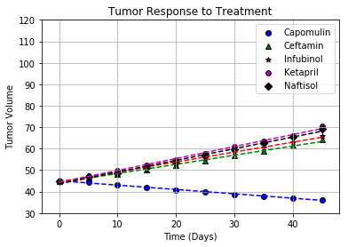


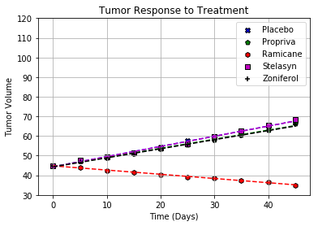


```python
##Making plots with less variables for visibility of the error bars
fig = plt.figure()
fig.suptitle("Tumor Response to Treatment",fontsize = 16,fontweight = "bold")
```


    Text(0.5,0.98,'Tumor Response to Treatment')


```python
ax1 = fig.add_subplot(111)
ax1.scatter(table1["Timepoint"],table1["Capomulin"], marker = "o",facecolors = "r",edgecolors = "black")
z = np.polyfit(table1["Timepoint"],table1["Capomulin"], 1)
p = np.poly1d(z)
cap, = ax1.plot(table1["Timepoint"],p(table1["Timepoint"]),"r--",label = "Capomulin")
ax1.errorbar(table1["Timepoint"],table1["Capomulin"],yerr = table1sem["Capomulin"],color = "r",fmt = "o")

ax1.scatter(table1["Timepoint"],table1["Ceftamin"], marker = "o",facecolors = "b",edgecolors = "black")
z = np.polyfit(table1["Timepoint"],table1["Ceftamin"], 1)
p = np.poly1d(z)
cap1, = ax1.plot(table1["Timepoint"],p(table1["Timepoint"]),"b--",label = "Ceftamin")
ax1.errorbar(table1["Timepoint"],table1["Ceftamin"],yerr = table1sem["Ceftamin"],color = "b",fmt = "o")

#ax2 = fig.add_subplot(122)
ax1.legend(handles =[cap,cap1],ncol=1)
#ax2.axis("Off")

ax1.set_ylabel("Tumor Volume (mm3)")
ax1.set_xlabel("Time (Days)")
ax1.grid(True)
plt.show()
```


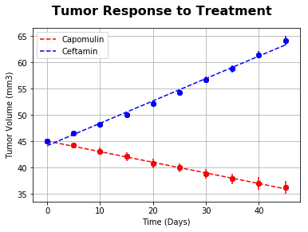


```python
fig1 = plt.figure()
fig1.suptitle("Tumor Response to Treatment",fontsize = 16,fontweight = "bold")
```


    Text(0.5,0.98,'Tumor Response to Treatment')


```python
ax3 = fig1.add_subplot(111)
ax3.scatter(table1["Timepoint"],table1["Infubinol"], marker = "o",facecolors = "g",edgecolors = "black")
(slope, intercept, _, _, _) = linregress(table1["Timepoint"], table1["Infubinol"])
fit = slope * table1["Timepoint"] + intercept
cap2, = ax3.plot(table1["Timepoint"], fit, 'g--',label = "Infubinol")
# z = np.polyfit(table1["Timepoint"],table1["Infubinol"], 1)
# p = np.poly1d(z)
# cap2, = ax1.plot(table1["Timepoint"],p(table1["Timepoint"]),"g--",label = "Infubinol")
ax3.errorbar(table1["Timepoint"],table1["Infubinol"],yerr = table1sem["Infubinol"],color = "g",fmt = "o")

ax3.scatter(table1["Timepoint"],table1["Ketapril"], marker = "o",facecolors = "m",edgecolors = "black")
(slope, intercept, _, _, _) = linregress(table1["Timepoint"], table1["Ketapril"])
fit = slope * table1["Timepoint"] + intercept
cap3, = ax3.plot(table1["Timepoint"], fit, 'm--',label = "Ketapril")
# z = np.polyfit(table1["Timepoint"],table1["Ketapril"], 1)
# p = np.poly1d(z)
# cap3, = ax3.plot(table1["Timepoint"],p(table1["Ketapril"]),"m--",label = "Ketapril")
ax3.errorbar(table1["Timepoint"],table1["Ketapril"],yerr = table1sem["Ketapril"],color = "m",fmt = "o")

#ax4 = fig1.add_subplot(122)
ax3.legend(handles =[cap2,cap3],ncol=1)
#ax4.axis("Off")


ax3.set_ylabel("Tumor Volume (mm3)")
ax3.set_xlabel("Time (Days)")
ax3.grid(True)
plt.show()
```


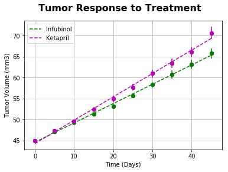


```python
fig2 = plt.figure()
fig2.suptitle("Tumor Response to Treatment",fontsize = 16,fontweight = "bold")
ax4 = fig2.add_subplot(111)
ax4.scatter(table1["Timepoint"],table1["Naftisol"], marker = "o",facecolors = "c",edgecolors = "black")
(slope, intercept, _, _, _) = linregress(table1["Timepoint"], table1["Naftisol"])
fit = slope * table1["Timepoint"] + intercept
cap4, = ax4.plot(table1["Timepoint"], fit, 'c--',label = "Naftisol")
ax4.errorbar(table1["Timepoint"],table1["Naftisol"],yerr = table1sem["Naftisol"],color = "c",fmt = "o")

ax4.scatter(table1["Timepoint"],table1["Placebo"], marker = "o",facecolors = "k",edgecolors = "black")
(slope, intercept, _, _, _) = linregress(table1["Timepoint"], table1["Placebo"])
fit = slope * table1["Timepoint"] + intercept
cap5, = ax4.plot(table1["Timepoint"], fit, 'k--',label = "Placebo")
ax4.errorbar(table1["Timepoint"],table1["Placebo"],yerr = table1sem["Placebo"],color = "k",fmt = "o")


ax4.legend(handles =[cap4,cap5],ncol=1)


ax4.set_ylabel("Tumor Volume (mm3)")
ax4.set_xlabel("Time (Days)")
ax4.grid(True)
plt.show()
```


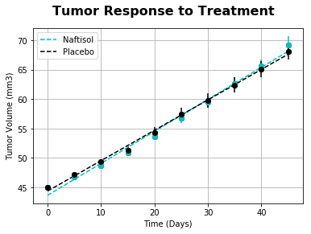


```python
fig3 = plt.figure()
fig3.suptitle("Tumor Response to Treatment",fontsize = 16,fontweight = "bold")
ax5 = fig3.add_subplot(111)
ax5.scatter(table1["Timepoint"],table1["Propriva"], marker = "o",facecolors = "orange",edgecolors = "black")
(slope, intercept, _, _, _) = linregress(table1["Timepoint"], table1["Propriva"])
fit = slope * table1["Timepoint"] + intercept
cap6, = ax5.plot(table1["Timepoint"], fit, 'r--',label = "Propriva")
ax5.errorbar(table1["Timepoint"],table1["Propriva"],yerr = table1sem["Propriva"],color = "orange",fmt = "o")

ax5.scatter(table1["Timepoint"],table1["Ramicane"], marker = "o",facecolors = "darkgreen",edgecolors = "black")
(slope, intercept, _, _, _) = linregress(table1["Timepoint"], table1["Ramicane"])
fit = slope * table1["Timepoint"] + intercept
cap7, = ax5.plot(table1["Timepoint"], fit, 'g--',label = "Ramicane")
ax5.errorbar(table1["Timepoint"],table1["Ramicane"],yerr = table1sem["Ramicane"],color = "darkgreen",fmt = "o")


ax5.legend(handles =[cap6,cap7],ncol=1)


ax5.set_ylabel("Tumor Volume (mm3)")
ax5.set_xlabel("Time (Days)")
ax5.grid(True)
plt.show()
```


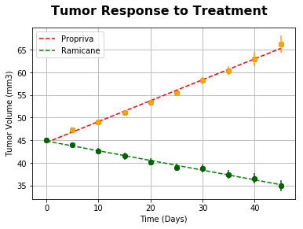


```python
fig4 = plt.figure()
fig4.suptitle("Tumor Response to Treatment",fontsize = 16,fontweight = "bold")
ax6 = fig4.add_subplot(111)
ax6.scatter(table1["Timepoint"],table1["Stelasyn"], marker = "o",facecolors = "navy",edgecolors = "black")
(slope, intercept, _, _, _) = linregress(table1["Timepoint"], table1["Stelasyn"])
fit = slope * table1["Timepoint"] + intercept
cap8, = ax6.plot(table1["Timepoint"], fit, 'b--',label = "Stelasyn")
ax6.errorbar(table1["Timepoint"],table1["Stelasyn"],yerr = table1sem["Stelasyn"],color = "navy",fmt = "o")

ax6.scatter(table1["Timepoint"],table1["Zoniferol"], marker = "o",facecolors = "violet",edgecolors = "black")
(slope, intercept, _, _, _) = linregress(table1["Timepoint"], table1["Zoniferol"])
fit = slope * table1["Timepoint"] + intercept
cap9, = ax6.plot(table1["Timepoint"], fit, 'r--',label = "Zoniferol")
ax6.errorbar(table1["Timepoint"],table1["Zoniferol"],yerr = table1sem["Zoniferol"],color = "violet",fmt = "o")


ax6.legend(handles =[cap8,cap9],ncol=1)


ax6.set_ylabel("Tumor Volume (mm3)")
ax6.set_xlabel("Time (Days)")
ax6.grid(True)
plt.show()
```


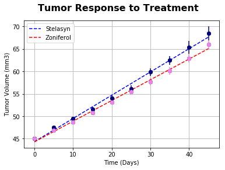


```python
##MetaStatic

merge_table1 = pd.merge(mousedata_pd, clinicaldata_pd, on="Mouse ID", how="outer")
merge_table1 = merge_table1[["Drug","Timepoint","Metastatic Sites"]]
table2sem = pd.pivot_table(merge_table1,values = "Metastatic Sites",index = ["Timepoint"],columns = ["Drug"],aggfunc=stats.sem)

table2 = pd.pivot_table(merge_table1,values = "Metastatic Sites",index = ["Timepoint"],columns = ["Drug"],aggfunc=np.mean)
table2["Timepoint"] = [0,5,10,15,20,25,30,35,40,45]
fig,ax = plt.subplots()
for i in range(((len(table2.columns)-1)-((len(table2.columns)-1))//2)):
    plt.scatter(table2["Timepoint"],table2[table2.columns[i+5]], marker = markers[i+5],facecolors =colors[i+5],edgecolors = "black")
    z = np.polyfit(table2["Timepoint"],table2[table2.columns[i+5]], 1)
    p = np.poly1d(z)
    plt.plot(table2["Timepoint"],p(table2["Timepoint"]),colors[i+5]+"--")


ax.legend(loc = "best")
plt.grid(True)
plt.title("Metastatic Spread During Treatment")
plt.ylabel("Met. Sites")
plt.xlabel("Treatment Duration (Days)")
plt.ylim(-1,5)
plt.show()


for i in range(((len(table2.columns)-1)-((len(table2.columns)-1))//2)):
    plt.scatter(table2["Timepoint"],table2[table2.columns[i]], marker = markers[i],facecolors =colors[i],edgecolors = "black")
    z = np.polyfit(table2["Timepoint"],table2[table2.columns[i]], 1)
    p = np.poly1d(z)
    plt.plot(table2["Timepoint"],p(table2["Timepoint"]),colors[i]+"--")

plt.legend(loc = "best")
plt.title("Metastatic Spread During Treatment")
plt.ylabel("Met. Sites")
plt.xlabel("Treatment Duration (Days)")
plt.ylim(-1,5)
plt.grid(True)
plt.show()

```


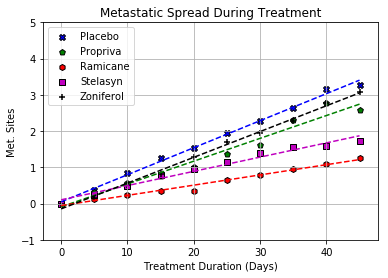


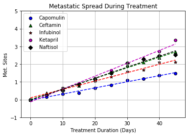


```python
##Survival Ratees now
merge_table = merge_table.drop("Metastatic Sites", axis = 1)
micesurv = merge_table.pivot_table(merge_table, index=['Drug','Timepoint'], aggfunc='count')

```


```python

micesurv = micesurv.rename(columns={"Mouse ID": "mouse count"})
mouse_survival = micesurv.pivot_table("mouse count",["Timepoint"],"Drug")
```


```python


##I wish I figured this out sooner.....
x_axis = np.arange(0, 50, 5)    
plt.xlim(0,50)
drugs = merge_table["Drug"].unique()
drugnum = np.arange(0,len(drugs))

for j in drugs:
    errors = stats.sem(table1sem[drugs[i]])

plt.title("Survival During Treatment")
plt.xlabel("Time(Days)")
plt.ylabel("Number of Mice Alive")
plt.grid(alpha = 0.5)
for i in range(len(drugs)):
    plt.errorbar(x_axis, mouse_survival[drugs[i]], yerr = errors, marker= markers[i], color= colors[i], alpha = 0.5, label = drugs[i])
    
##I googled this plt.legend thing...
plt.legend(bbox_to_anchor=(1.05,1),loc= 2, borderaxespad = 0.)
plt.xticks(np.arange(min(x_axis)-5, max(x_axis)+5, 5.0))
plt.show()
```


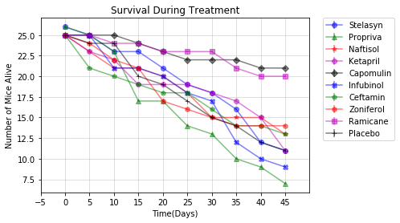


```python
##Survival Rates

percentsurv = (1-(mouse_survival.iloc[0]- mouse_survival)/mouse_survival.iloc[0])*100
percentsurv
```


<div>
<style>
    .dataframe thead tr:only-child th {
        text-align: right;
    }

    .dataframe thead th {
        text-align: left;
    }

    .dataframe tbody tr th {
        vertical-align: top;
    }
</style>
<table border="1" class="dataframe">
  <thead>
    <tr style="text-align: right;">
      <th>Drug</th>
      <th>Capomulin</th>
      <th>Ceftamin</th>
      <th>Infubinol</th>
      <th>Ketapril</th>
      <th>Naftisol</th>
      <th>Placebo</th>
      <th>Propriva</th>
      <th>Ramicane</th>
      <th>Stelasyn</th>
      <th>Zoniferol</th>
    </tr>
    <tr>
      <th>Timepoint</th>
      <th></th>
      <th></th>
      <th></th>
      <th></th>
      <th></th>
      <th></th>
      <th></th>
      <th></th>
      <th></th>
      <th></th>
    </tr>
  </thead>
  <tbody>
    <tr>
      <th>0</th>
      <td>100.0</td>
      <td>100.0</td>
      <td>100.0</td>
      <td>100.0</td>
      <td>100.0</td>
      <td>100.0</td>
      <td>100.000000</td>
      <td>100.0</td>
      <td>100.000000</td>
      <td>100.0</td>
    </tr>
    <tr>
      <th>5</th>
      <td>100.0</td>
      <td>84.0</td>
      <td>100.0</td>
      <td>92.0</td>
      <td>92.0</td>
      <td>96.0</td>
      <td>96.153846</td>
      <td>100.0</td>
      <td>96.153846</td>
      <td>96.0</td>
    </tr>
    <tr>
      <th>10</th>
      <td>100.0</td>
      <td>80.0</td>
      <td>84.0</td>
      <td>88.0</td>
      <td>84.0</td>
      <td>96.0</td>
      <td>88.461538</td>
      <td>96.0</td>
      <td>88.461538</td>
      <td>88.0</td>
    </tr>
    <tr>
      <th>15</th>
      <td>96.0</td>
      <td>76.0</td>
      <td>84.0</td>
      <td>76.0</td>
      <td>84.0</td>
      <td>80.0</td>
      <td>65.384615</td>
      <td>96.0</td>
      <td>88.461538</td>
      <td>84.0</td>
    </tr>
    <tr>
      <th>20</th>
      <td>92.0</td>
      <td>72.0</td>
      <td>80.0</td>
      <td>76.0</td>
      <td>80.0</td>
      <td>76.0</td>
      <td>65.384615</td>
      <td>92.0</td>
      <td>80.769231</td>
      <td>68.0</td>
    </tr>
    <tr>
      <th>25</th>
      <td>88.0</td>
      <td>72.0</td>
      <td>72.0</td>
      <td>76.0</td>
      <td>72.0</td>
      <td>68.0</td>
      <td>53.846154</td>
      <td>92.0</td>
      <td>73.076923</td>
      <td>64.0</td>
    </tr>
    <tr>
      <th>30</th>
      <td>88.0</td>
      <td>64.0</td>
      <td>68.0</td>
      <td>72.0</td>
      <td>60.0</td>
      <td>60.0</td>
      <td>50.000000</td>
      <td>92.0</td>
      <td>69.230769</td>
      <td>60.0</td>
    </tr>
    <tr>
      <th>35</th>
      <td>88.0</td>
      <td>56.0</td>
      <td>48.0</td>
      <td>68.0</td>
      <td>60.0</td>
      <td>56.0</td>
      <td>38.461538</td>
      <td>84.0</td>
      <td>61.538462</td>
      <td>56.0</td>
    </tr>
    <tr>
      <th>40</th>
      <td>84.0</td>
      <td>56.0</td>
      <td>40.0</td>
      <td>60.0</td>
      <td>60.0</td>
      <td>48.0</td>
      <td>34.615385</td>
      <td>80.0</td>
      <td>46.153846</td>
      <td>56.0</td>
    </tr>
    <tr>
      <th>45</th>
      <td>84.0</td>
      <td>52.0</td>
      <td>36.0</td>
      <td>44.0</td>
      <td>52.0</td>
      <td>44.0</td>
      <td>26.923077</td>
      <td>80.0</td>
      <td>42.307692</td>
      <td>56.0</td>
    </tr>
  </tbody>
</table>
</div>


```python

for i in range(len(drugs)):
    plt.errorbar(x_axis, percentsurv[drugs[i]], yerr = errors, marker= markers[i], color= colors[i], alpha = 0.5, label = drugs[i])
plt.title("Survival During Treatment")
plt.xlabel("Time(Days)")
plt.ylabel("Survival Rate (%)")
plt.grid(alpha = 0.5)
plt.legend(bbox_to_anchor=(1.05,1),loc= 2, borderaxespad = 0.)
plt.xticks(np.arange(min(x_axis)-5, max(x_axis)+5, 5.0))
plt.show()
```


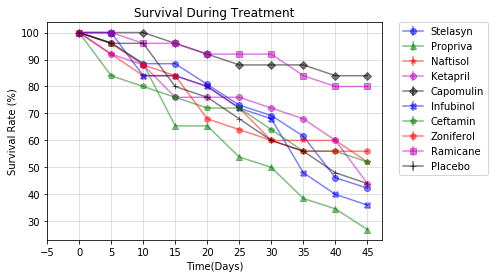


```python
del table1["Timepoint"]
firstlast = table1.iloc[[0,-1]]
```


```python
percentchange = ((firstlast-firstlast.iloc[0])/firstlast.iloc[0])*100
```


```python
lastrow = percentchange.loc[1:]
lastrow.sum()
```


    Drug
    Capomulin   -19.475303
    Ceftamin     42.516492
    Infubinol    46.123472
    Ketapril     57.028795
    Naftisol     53.923347
    Placebo      51.297960
    Propriva     47.241175
    Ramicane    -22.320900
    Stelasyn     52.085134
    Zoniferol    46.579751
    dtype: float64


```python
tumorsize = {}
tick_locations = []
for i in range(len(drugs)):
    tumorsize[drugs[i]]=float(lastrow[drugs[i]])
    
for x in x_axis:
    tick_locations.append(x+0.4)

plt.xlim(-0.25, len(drugs))
plt.ylim(min(tumorsize.values()) - 5, max(tumorsize.values()) + 5)
plt.title("Tumor Volume Change  Over 45 Day Treatment")
plt.ylabel("% Change in Tumor Size")

##Googled this as well....
barcol = pd.Series(list(tumorsize.values()))
barcol = barcol > 0
barcol= barcol.map({True: "Red", False: "Green"})
plt.xticks(tick_locations, tumorsize, rotation="vertical")
plt.bar(x_axis, tumorsize.values(), color=barcol, alpha=0.75, align="edge")
plt.show()
```


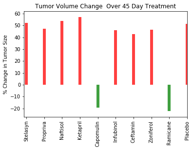

